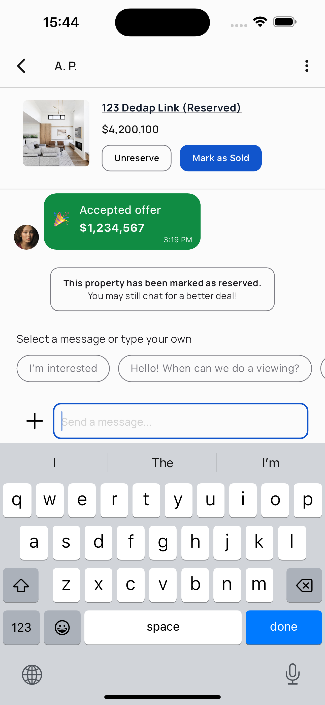
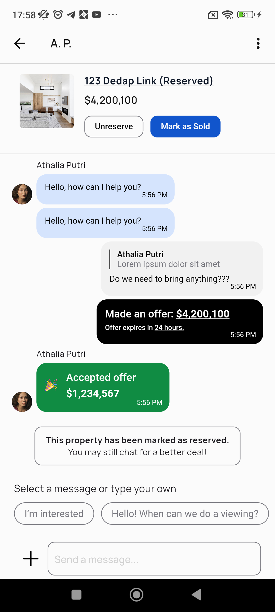

# selling_houses

A Flutter project for managing and selling houses.

## Introduction

This project is designed to help users manage and sell houses efficiently using a Flutter application. It provides a user-friendly interface and various features to streamline the process of selling houses.

## Required Flutter Version

To run this project, you need to have Flutter version 3.22.0 or higher installed on your machine.

## Installing FVM

FVM (Flutter Version Management) is a tool to manage different Flutter SDK versions per project. To install FVM, use the following command:

```bash
pub global activate fvm
```

After installing FVM, you can install the required Flutter version for this project by running:

```bash
fvm install 3.22.0
```

Then, use the following command to set the Flutter version for the project:

```bash
fvm use 3.22.0
```

## How to Run Code

To run the code use the following commands steps:

1. Get the Flutter packages:

  ```bash
  fvm flutter pub get
  ```
2. Run the code generator:

  ```bash
  fvm flutter packages pub run build_runner build --delete-conflicting-outputs
  fvm flutter pub run intl_utils:generate

  ```
3. Run the project:

  ```bash
  fvm flutter run
  ```

## Result Images

Here are examples of the application in action:

  <table>
    <tr>
      <td></td>
      <td></td>
    </tr>
    <tr>
      <td></td>
      <td></td>
    </tr>
  </table>

